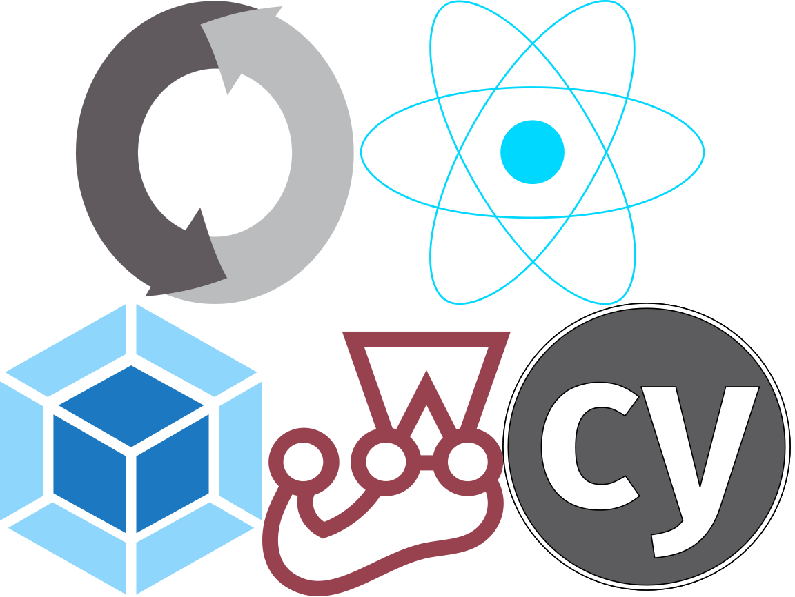
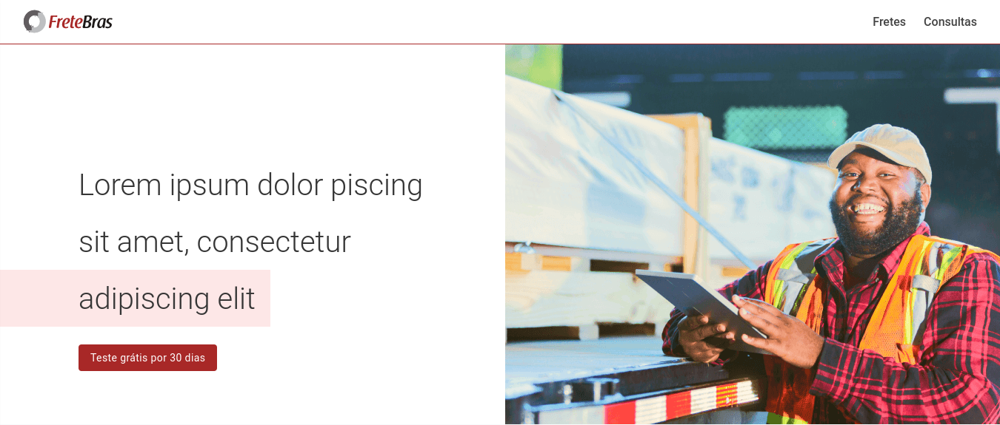
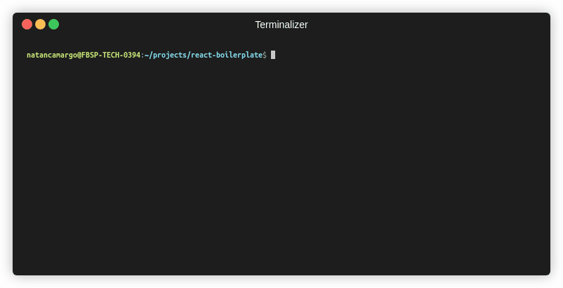

[](https://reactjs.org/)
[](https://github.com/facebook/jest)
[](https://www.cypress.io/)

[](https://github.com/airbnb/javascript)
[](https://github.com/prettier/prettier)

<a href="."></a>

# React Boilerplate

Bootstrap your ideas in seconds!

</img>

## Commands

Install dependencies

```bash
npm install
```

Run

```bash
npm start
```

Test (unit + e2e)

```bash
npm test
```


